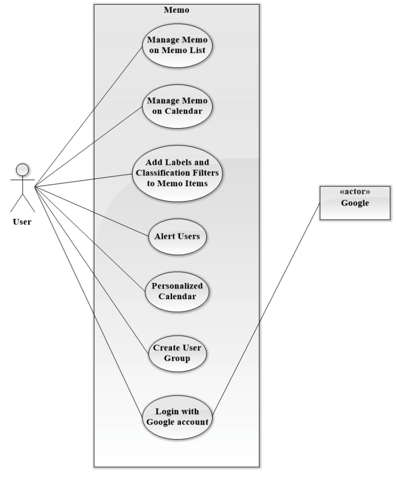
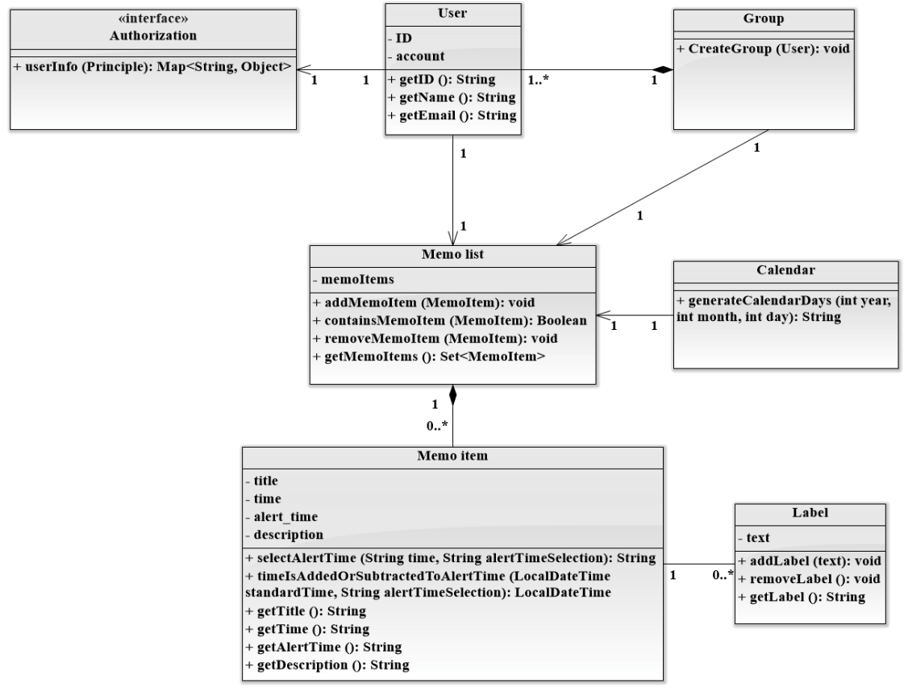
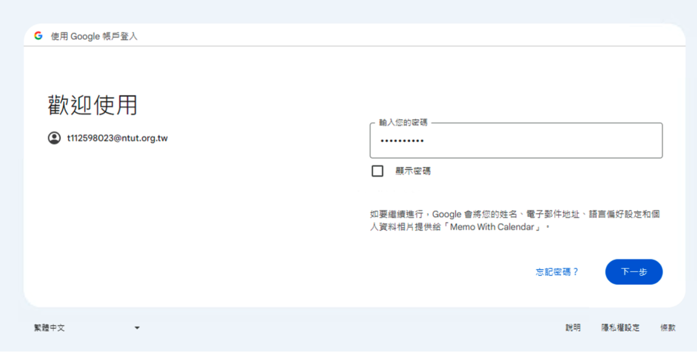
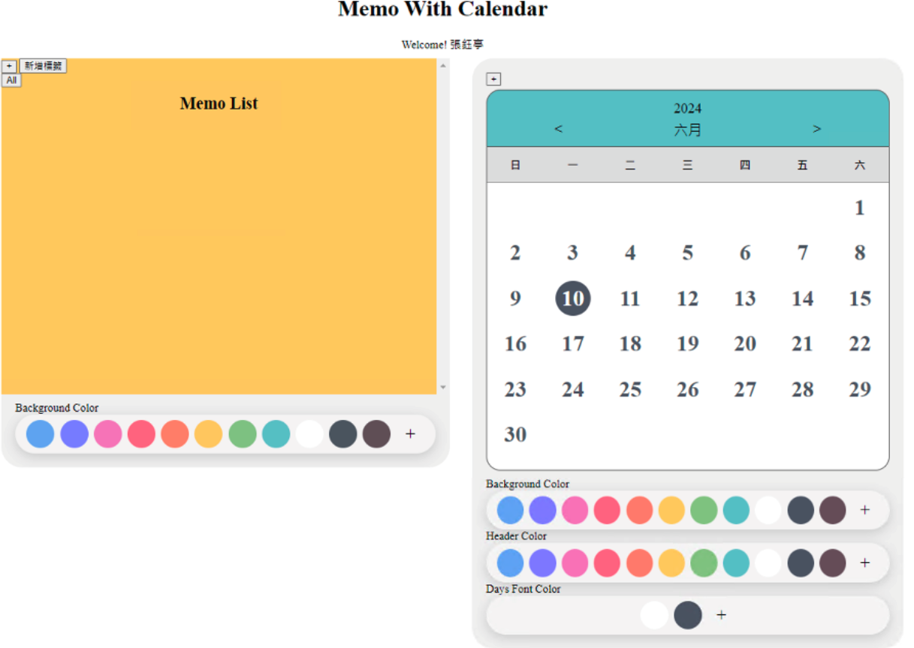
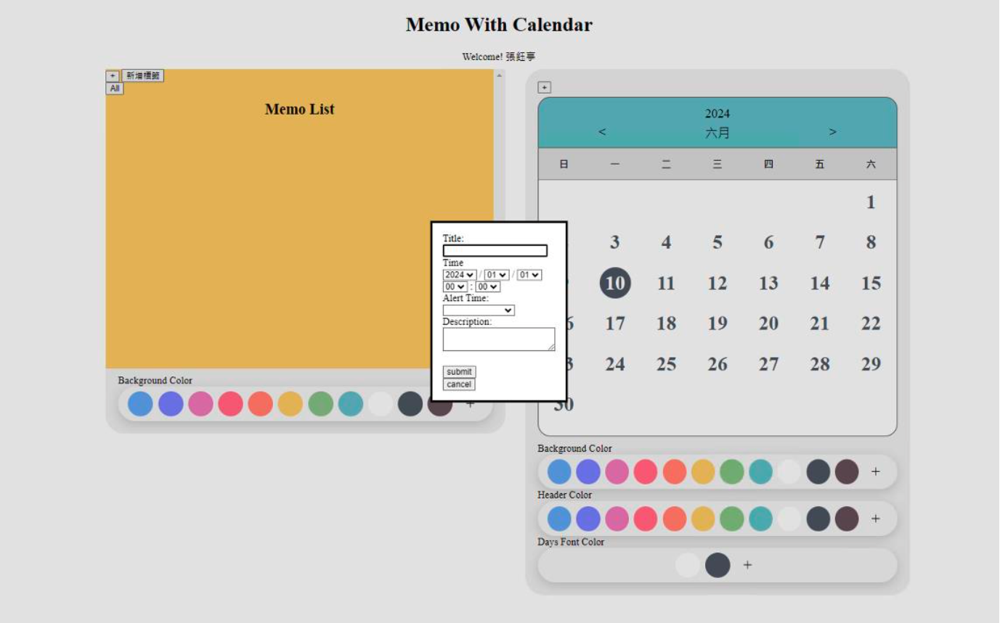
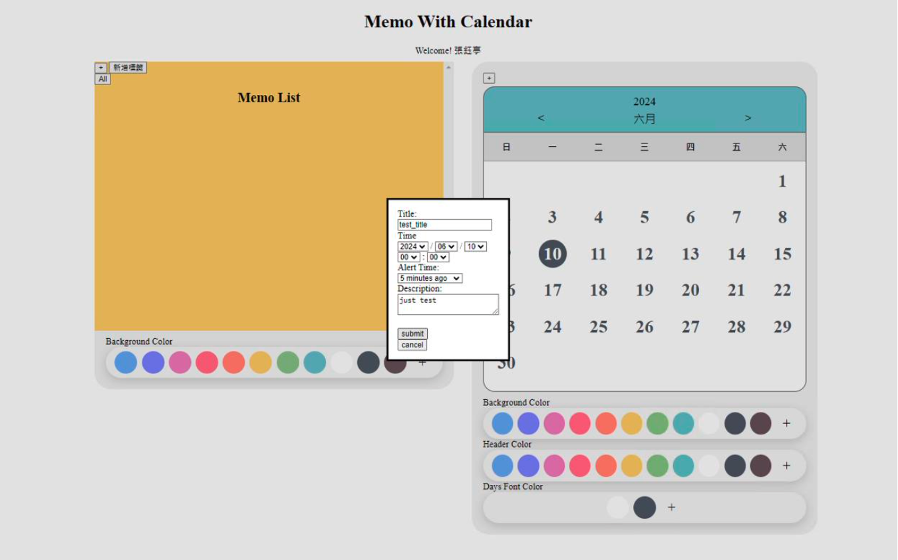
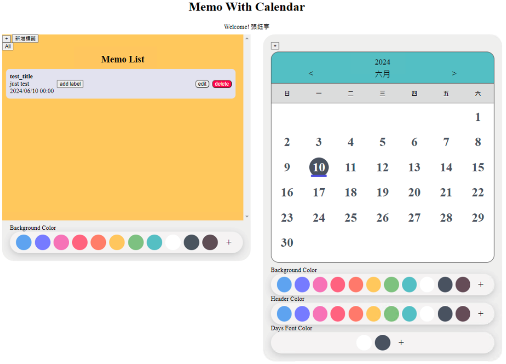

# Multifunctional Memo with Calendar

OOAD 課程專題
設計細節可查看[設計報告文件](./final_report.pdf)

## Introduction

這個web application是一個簡單使用的備忘錄結合行事曆的軟體。  
每個人的日常生活中都有許多事項需要處理，有個方便列出待辦事項並且清楚表示未來行程規劃的工具能夠使規劃簡單許多，例如進行小組作業的學生們可以使用這個軟體進行代辦事項的共享，並一同規劃未來行程。  
這個軟體將藉由網頁，使用HTML搭配CSS語法做介面設計，後端功能邏輯運作使用Java進行設計，採前後端分離，由後端做運算及事件處理再交由前端呈現。  
使用者可以新增待辦項目並描述該事項的細節，加入日期便可在行事曆上做出標記，方便看出何時有行程需要處理，並且可以加入事項的重要性或分類標籤，在待辦事項列表中可以使用這兩項因素來做排序與整理。 

## Use case diagram

## Design Class Model

## Snapshots of system execution

- Login

- Main page

- Create memo

